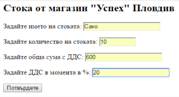
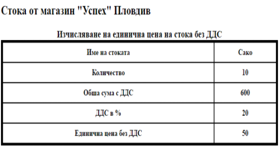

# shop-uspeh
Да се състави приложение за:
 1/ Въвеждане от форма на начални стойности за четири величини:
 1/ име на стоката;  2/ количество на стоката; 
 3/ обща сума с ДДС; 4/ ДДС в момента в % (различно е за различните страни).
 2/ Изчисляване на единичната цена без ДДС, закръглена до стотинки, като се използва функция за закръгляване round(z,d), която при аргумент реално число z връща число, закръглено до  d  позиции след десетичната точка.
 3/ Извеждане на крайния резултат в таблица заедно с всички начални данни.

 Примерен изглед за постановката и решението на задачата:

